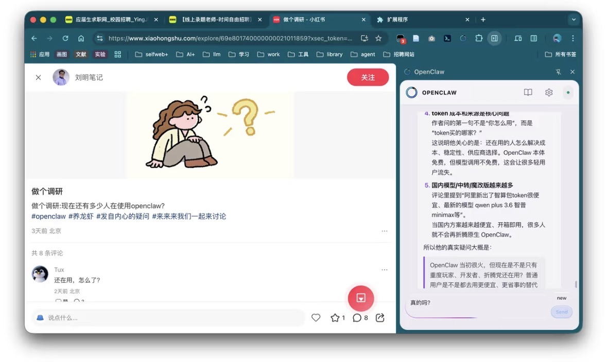

# OpenClaw Pilot

OpenClaw Pilot is a browser-side Agent pilot for capturing web context and turning active pages into actionable input for intelligent agents.

It started as a Chrome extension side panel for OpenClaw, with hooks for reading page content, injecting browser context, and routing actions through a reverse gateway. The direction is to evolve it into a lightweight browser control layer where agents can observe pages, understand user context, and delegate tasks to model backends such as Gemini, Claude-compatible services, or other OpenClaw-connected agents.

## What It Does

- Runs as a Manifest V3 Chrome extension.
- Opens an OpenClaw side panel directly inside the browser.
- Captures and injects webpage context for downstream agent workflows.
- Provides reverse gateway modules for routing browser-side actions.
- Includes content scripts, side panel UI assets, extension icons, and declarative network rules.

## Product Direction

OpenClaw Pilot is intended to become a browser Agent bridge:

- Webpage capture: extract the current page, selected content, and browser state as agent context.
- Agent delegation: route user tasks from the browser to OpenClaw agents.
- Multi-model support: prepare the extension layer for Gemini, Claude-compatible models, and other model providers.
- Browser automation: expose controlled browser actions through the extension runtime.
- Side-panel workflow: keep the agent close to the active browsing session without switching apps.

## Repository Layout

- `manifest.json`: Chrome extension manifest.
- `background.js`: extension service worker.
- `src/content-script.js`: page content bridge.
- `src/read-inject.js`: injected page reader.
- `src/reverse/`: reverse gateway and RPC modules.
- `src/sidepanel.html`: side panel entry point.
- `assets/`: bundled side panel assets and locale files.
- `icons/`: extension icons and source artwork.
- `docs/images/`: screenshots and project media.

## Status

This repository currently contains the reverse-engineered extension package and supporting source fragments. The next development step is to clean up the extension architecture, document the gateway contract, and formalize the agent-facing API.

---

# OpenClaw Pilot 中文说明

OpenClaw Pilot 是一个运行在浏览器侧的智能体 Agent Pilot，用来抓取网页上下文，并把当前页面转化为可供智能体理解和执行任务的输入。

它最初是一个 OpenClaw 的 Chrome 扩展侧边栏，包含页面内容读取、网页上下文注入、侧边栏交互和反向网关路由等能力。后续方向是把它演进成轻量级的浏览器控制层，让智能体能够观察网页、理解用户当前上下文，并把任务代理给 Gemini、Claude 兼容服务或其他接入 OpenClaw 的智能体。

## 当前能力

- 基于 Manifest V3 的 Chrome 扩展。
- 在浏览器侧边栏中直接打开 OpenClaw。
- 抓取并注入网页上下文，供后续 Agent 工作流使用。
- 提供反向网关模块，用于路由浏览器侧动作。
- 包含内容脚本、侧边栏 UI 资源、扩展图标和声明式网络规则。

## 产品方向

OpenClaw Pilot 的目标是成为浏览器里的 Agent 桥接层：

- 网页抓取：提取当前页面、选中文本和浏览器状态，作为智能体上下文。
- Agent 代理：把用户在浏览器里的任务路由给 OpenClaw 智能体。
- 多模型支持：为 Gemini、Claude 兼容模型和其他模型供应商预留扩展层。
- 浏览器自动化：通过扩展运行时暴露受控的浏览器操作能力。
- 侧边栏工作流：让智能体贴近当前浏览场景，不需要频繁切换应用。

## 仓库结构

- `manifest.json`：Chrome 扩展清单。
- `background.js`：扩展 service worker。
- `src/content-script.js`：页面内容桥接脚本。
- `src/read-inject.js`：页面读取注入脚本。
- `src/reverse/`：反向网关与 RPC 模块。
- `src/sidepanel.html`：侧边栏入口页面。
- `assets/`：侧边栏构建资源和多语言文件。
- `icons/`：扩展图标和源文件。
- `docs/images/`：截图和项目媒体资源。

## 当前状态

这个仓库目前保存的是逆向整理后的扩展包和部分支撑源码。下一步适合清理扩展架构、补充网关协议文档，并把面向 Agent 的 API 规范化。
